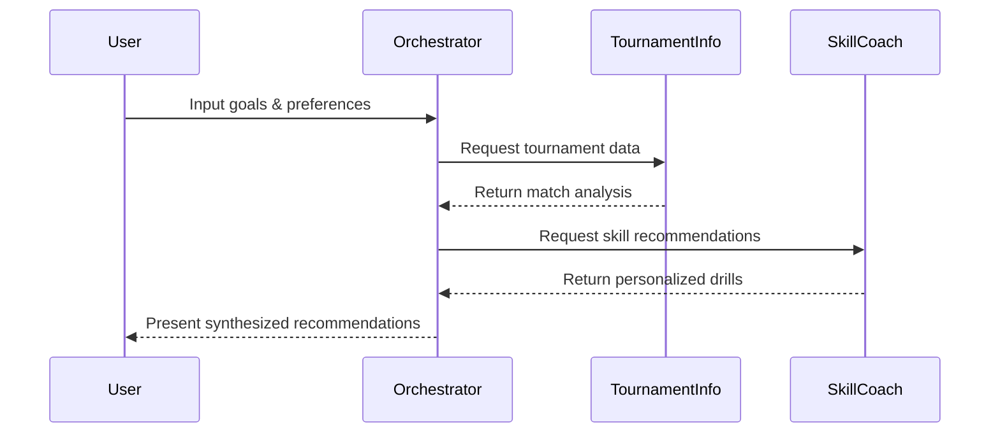

# Tennis Tournament Analysis System - Solution Design

## System Overview
The Tennis Tournament Analysis System is a multi-agent AI system designed to help tennis players improve their skills by analyzing professional tournaments and providing personalized recommendations. The system consists of three specialized AI agents working in concert to deliver comprehensive tennis development guidance.

## Architecture

### 1. System Components

#### 1.1 Orchestrator Agent
- **Role**: Central coordinator for tennis analysis workflow
- **Model**: Thinking Model
- **Key Responsibilities**:
  - Manage analysis workflow between agents
  - Synthesize insights from tournament and skill analysis
  - Generate comprehensive tennis development reports
  - Track implementation of recommendations

#### 1.2 Tournament Info Agent
- **Role**: Tennis match and tournament analysis specialist
- **Model**: gpt-4o-mini
- **Key Responsibilities**:
  - Analyze tournament matches and key points
  - Extract player tactics and patterns
  - Compile match statistics and highlights
  - Identify critical moments and decision points

#### 1.3 Tennis Skill Coach Agent
- **Role**: Technical and strategic tennis advisor
- **Model**: gpt-4o-mini
- **Key Responsibilities**:
  - Match Situation Analysis:
    - Key point analysis and decision making
    - Game strategy patterns
    - Score management tactics
  - Technical Analysis:
    - Stroke technique breakdown
    - Footwork and movement patterns
    - Shot selection principles
  - Mental Game:
    - Match psychology insights
    - Pressure point handling
    - Mental preparation strategies

### 2. Technical Infrastructure

#### 2.1 Core Technologies
- Python-based implementation
- Google ADK/A2A Framework
- OpenAI-compatible endpoints
- Environment-based configuration

#### 2.2 Data Storage
- simpel local database solution
- Tournament information cache
- Match analysis repository
- Progress tracking system

#### 2.3 Integration Points
- Tennis tournament APIs
- Web scraping interfaces
- Video reference system

## Web Frontend Architecture

### 1. Technology Stack
- **Framework**: Next.js (React)
- **Styling**: Tailwind CSS
- **State Management**: React Query + Zustand
- **API Integration**: Axios/Fetch
- **UI Components**: Headless UI + Custom Components

### 2. Key Features

#### 2.1 Main Pages
- **Dashboard**
  - Tournament overview
  - Recent analyses
  - Quick actions
  
- **Match Analysis**
  - Match replay viewer
  - Point-by-point breakdown
  - Statistical visualizations
  
- **Skill Development**
  - Technique analysis viewer
  - Training recommendations
  - Progress tracking

#### 2.2 Interactive Components
- **Match Timeline**
  - Interactive point navigation
  - Key moment markers
  - Video timestamp integration
  
- **Technique Viewer**
  - Split-screen comparison
  - Slow-motion playback
  - Annotation tools
  
- **Strategy Board**
  - Court position visualization
  - Shot pattern diagrams
  - Tactical annotations

### 3. User Experience

#### 3.1 Layout
- Responsive design for all devices
- Sidebar navigation
- Collapsible panels
- Dark/Light mode support

#### 3.2 Interactions
- Drag-and-drop interface
- Keyboard shortcuts
- Touch gestures for mobile
- Real-time updates

### 4. Frontend-Backend Integration

#### 4.1 API Structure
- RESTful endpoints
- WebSocket for real-time updates
- File upload/download handlers

#### 4.2 Data Flow
- Client-side caching
- Optimistic updates
- Error handling
- Loading states

### 5. Performance Optimization
- Code splitting
- Lazy loading
- Image optimization
- Performance monitoring

## Implementation Plan

### Phase 1: Core Setup
1. Environment configuration
2. Agent initialization
3. Basic communication flow
4. User profile management

### Phase 2: Data Integration
1. Tournament API connections
2. Web scraping implementation
3. Database setup
4. Data processing pipelines

### Phase 3: Feature Development
1. Match analysis system
2. Drill recommendation engine
3. Progress tracking
4. User interface development

## System Flow

## Security Considerations

1. **API Security**
   - Secure storage of API keys
   - Rate limiting implementation
   - Request validation

2. **User Data Protection**
   - Encrypted storage
   - Access control
   - Data retention policies

## Scalability Considerations

1. **System Expansion**
   - Additional agent integration capability
   - Modular component design
   - Pluggable analysis tools

2. **Performance Optimization**
   - Caching strategies
   - Asynchronous processing
   - Load balancing

## Future Enhancements

1. **Additional Features**
   - Video analysis integration
   - Real-time match feedback
   - Social features
   - Mobile app integration

2. **AI Improvements**
   - Model fine-tuning
   - Custom training data
   - Enhanced personalization

## Success Metrics

1. **User Progress**
   - Skill improvement tracking
   - Goal achievement rate
   - User engagement metrics

2. **System Performance**
   - Response time
   - Recommendation accuracy
   - User satisfaction scores

## Maintenance Plan

1. **Regular Updates**
   - Weekly data refresh
   - Monthly performance review
   - Quarterly feature updates

2. **Monitoring**
   - System health checks
   - Usage analytics
   - Error tracking

## Risk Mitigation

1. **Technical Risks**
   - API availability
   - Data accuracy
   - System performance

2. **User Risks**
   - Skill level mismatch
   - Information overload
   - Engagement drop-off

## Development Guidelines

1. **Code Standards**
   - PEP 8 compliance
   - Documentation requirements
   - Testing protocols

2. **Development Process**
   - Version control workflow
   - Code review requirements
   - Deployment procedures
